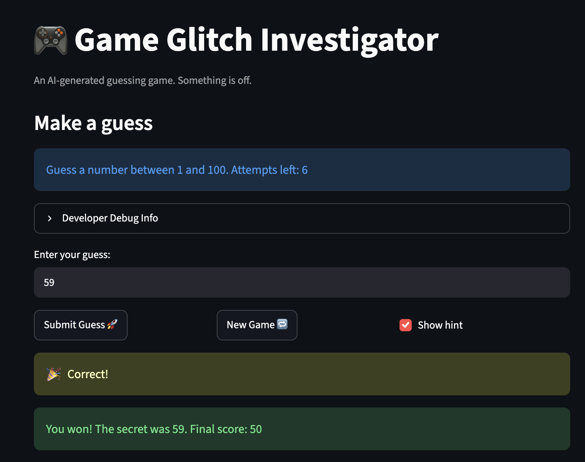
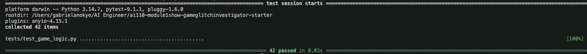

# 🎮 Game Glitch Investigator: The Impossible Guesser

## 🚨 The Situation

You asked an AI to build a simple "Number Guessing Game" using Streamlit.
It wrote the code, ran away, and now the game is unplayable. 

- You can't win.
- The hints lie to you.
- The secret number seems to have commitment issues.

## 🛠️ Setup

1. Install dependencies: `pip install -r requirements.txt`
2. Run the broken app: `python -m streamlit run app.py`

## 🕵️‍♂️ Your Mission

1. **Play the game.** Open the "Developer Debug Info" tab in the app to see the secret number. Try to win.
2. **Find the State Bug.** Why does the secret number change every time you click "Submit"? Ask ChatGPT: *"How do I keep a variable from resetting in Streamlit when I click a button?"*
3. **Fix the Logic.** The hints ("Higher/Lower") are wrong. Fix them.
4. **Refactor & Test.** - Move the logic into `logic_utils.py`.
   - Run `pytest` in your terminal.
   - Keep fixing until all tests pass!

## 📝 Document Your Experience

- [ ] Describe the game's purpose.
   This game is to give the user attempts to guess a secret number while giving guides after each entry to assist them get it right
- [ ] Detail which bugs you found.
1. The hints are interchange that is hints says "Go Lower" when the actual number is higher and vice versa.
2. The start new game key doesn't work when you are out of guesses or secret is found unless page is refreshed but starts a new game when you have some guess left
3. When you type an answer in the box you are been prompted to press "enter" key to guess but it doesn't submit
4. New game only refreshes guess count but does not clear the guess input box
5. After guessing the right number, final score shows incorrectly
6. The difficulty range should be easy(1-20), medium(1-50), hard(1-100) instead medium and hard are interchanged
- [ ] Explain what fixes you applied.
The hint displays correctly when user types in incorrect answer, either to go higher or lower if the value is smaller or greater respectively.
Made the medium range 1-50 and hard range 1- 100
In the score section, made the subtraction of points no matter the wrong input same.

## 📸 Demo Walkthrough

Describe your fixed game in numbered steps so a reader can follow along without watching a video:

1. User enters a guess of 65
2. Game returns "Go LOWER"
3. User enters a guess of 58 → "Go HIGHER"
4. User enters a guess of 59 - "Correct!"
5. Game ends "You won! The secret is 13. Final score:50"

**Screenshot** *(optional)*: <!-- Insert a screenshot of your fixed, winning game here -->


## 🧪 Test Results

```
======================================================================================= test session starts ========================================================================================
platform darwin -- Python 3.14.7, pytest-9.1.1, pluggy-1.6.0
rootdir: /Users/gabrielanokye/AI Engineer/ai110-module1show-gameglitchinvestigator-starter
plugins: anyio-4.15.1
collected 42 items                                                                                                                                                                                 

tests/test_game_logic.py ..........................................                                                                                                                          [100%]

======================================================================================== 42 passed in 0.03s ========================================================================================
```


## 🚀 Stretch Features

- [ ] [If you choose to complete Challenge 4, describe the Enhanced UI changes here — a screenshot is optional]
